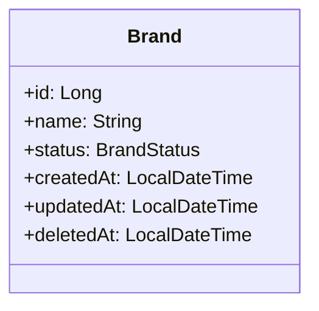
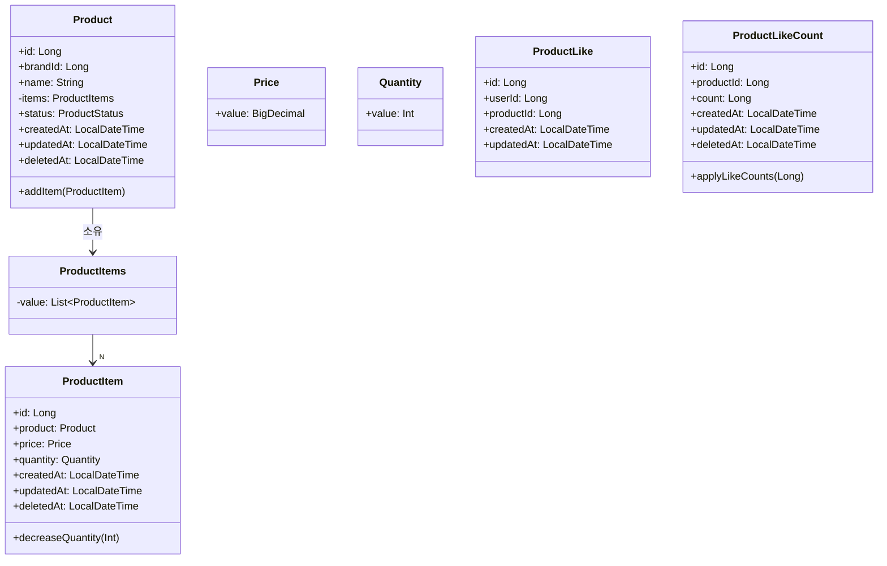
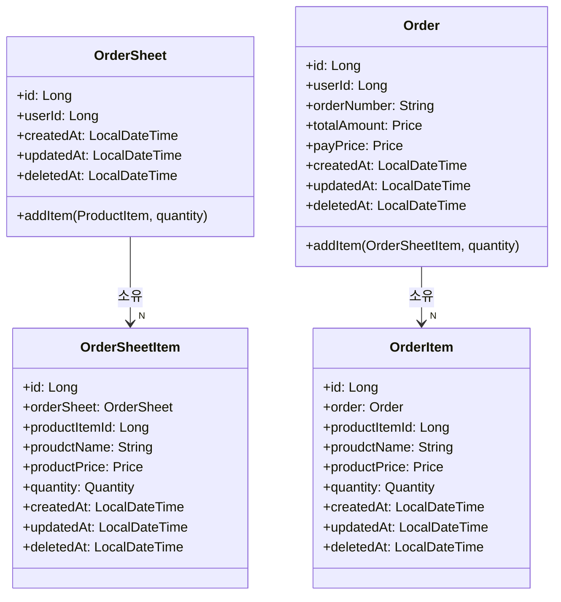
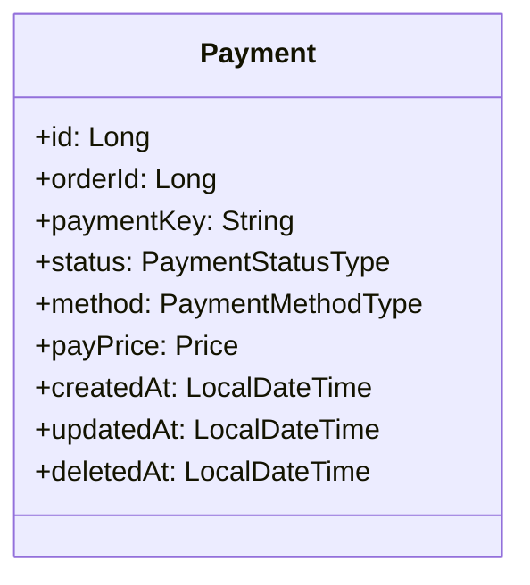
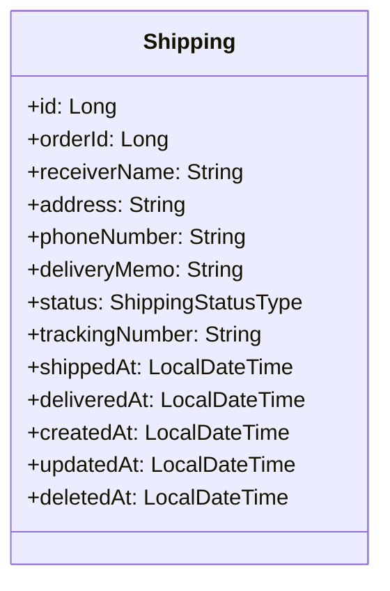

```mermaid
classDiagram
    class Brand {
        +id: Long
        +name: String
        +status: BrandStatus
        +createdAt: LocalDateTime
        +updatedAt: LocalDateTime
        +deletedAt: LocalDateTime
    }
```

```mermaid
classDiagram    
    class Product {
        +id: Long
        +brandId: Long
        +name: String
        -items: ProductItems
        +status: ProductStatus
        +createdAt: LocalDateTime
        +updatedAt: LocalDateTime
        +deletedAt: LocalDateTime
        +addItem(ProductItem)
    }
    
    class ProductItems {
        -value: List~ProductItem~
    }
    
    class ProductItem {
        +id: Long
        +product: Product
        +price: Price
        +quantity: Quantity
        +createdAt: LocalDateTime
        +updatedAt: LocalDateTime
        +deletedAt: LocalDateTime
        +decreaseQuantity(Int)
    }
    
    class Price {
        +value: BigDecimal
    }
    
    class Quantity {
        +value: Int
    }
    
    class ProductLike {
        +id: Long
        +userId: Long
        +productId: Long
        +createdAt: LocalDateTime
        +updatedAt: LocalDateTime
    }

    class ProductLikeCount {
        +id: Long
        +productId: Long
        +count: Long
        +createdAt: LocalDateTime
        +updatedAt: LocalDateTime
        +deletedAt: LocalDateTime
        +applyLikeCounts(Long)
    }

    Product --> ProductItems: 소유
    ProductItems --> "N" ProductItem
```

```mermaid
classDiagram
    class OrderSheet {
        +id: Long
        +userId: Long
        +createdAt: LocalDateTime
        +updatedAt: LocalDateTime
        +deletedAt: LocalDateTime
        +addItem(ProductItem, quantity)
    }
    
    class OrderSheetItem {
        +id: Long
        +orderSheet: OrderSheet
        +productItemId: Long
        +proudctName: String
        +productPrice: Price
        +quantity: Quantity
        +createdAt: LocalDateTime
        +updatedAt: LocalDateTime
        +deletedAt: LocalDateTime
    }
    
    class Order {
        +id: Long
        +userId: Long
        +orderNumber: String
        +totalAmount: Price
        +payPrice: Price
        +createdAt: LocalDateTime
        +updatedAt: LocalDateTime
        +deletedAt: LocalDateTime
        +addItem(OrderSheetItem, quantity)
    }

    class OrderItem {
        +id: Long
        +order: Order
        +productItemId: Long
        +proudctName: String
        +productPrice: Price
        +quantity: Quantity
        +createdAt: LocalDateTime
        +updatedAt: LocalDateTime
        +deletedAt: LocalDateTime
    }

    OrderSheet --> "N" OrderSheetItem: 소유
    Order --> "N" OrderItem: 소유
```

```mermaid
classDiagram
    class Payment {
        +id: Long
        +orderId: Long
        +paymentKey: String
        +status: PaymentStatusType
        +method: PaymentMethodType
        +payPrice: Price
        +createdAt: LocalDateTime
        +updatedAt: LocalDateTime
        +deletedAt: LocalDateTime
    }
```

```mermaid
classDiagram
    class Shipping {
        +id: Long
        +orderId: Long
        +receiverName: String
        +address: String
        +phoneNumber: String
        +deliveryMemo: String
        +status: ShippingStatusType
        +trackingNumber: String
        +shippedAt: LocalDateTime
        +deliveredAt: LocalDateTime
        +createdAt: LocalDateTime
        +updatedAt: LocalDateTime
        +deletedAt: LocalDateTime
    }
```