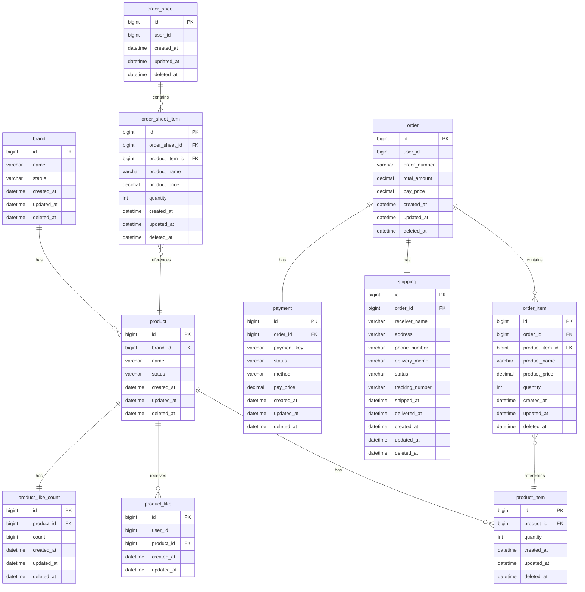

```mermaid
erDiagram
    brand {
        bigint id PK
        varchar name
        varchar status
        datetime created_at
        datetime updated_at
        datetime deleted_at
    }

    product {
        bigint id PK
        bigint brand_id FK
        varchar name
        varchar status
        datetime created_at
        datetime updated_at
        datetime deleted_at
    }

    product_item {
        bigint id PK
        bigint product_id FK
        int quantity
        datetime created_at
        datetime updated_at
        datetime deleted_at
    }

    product_like {
        bigint id PK
        bigint user_id
        bigint product_id FK
        datetime created_at
        datetime updated_at
    }

    product_like_count {
        bigint id PK
        bigint product_id FK
        bigint count
        datetime created_at
        datetime updated_at
        datetime deleted_at
    }

    order_sheet {
        bigint id PK
        bigint user_id
        datetime created_at
        datetime updated_at
        datetime deleted_at
    }

    order_sheet_item {
        bigint id PK
        bigint order_sheet_id FK
        bigint product_item_id FK
        varchar product_name
        decimal product_price
        int quantity
        datetime created_at
        datetime updated_at
        datetime deleted_at
    }

    order {
        bigint id PK
        bigint user_id
        varchar order_number
        decimal total_amount
        decimal pay_price
        datetime created_at
        datetime updated_at
        datetime deleted_at
    }

    order_item {
        bigint id PK
        bigint order_id FK
        bigint product_item_id FK
        varchar product_name
        decimal product_price
        int quantity
        datetime created_at
        datetime updated_at
        datetime deleted_at
    }

    shipping {
        bigint id PK
        bigint order_id FK
        varchar receiver_name
        varchar address
        varchar phone_number
        varchar delivery_memo
        varchar status
        varchar tracking_number
        datetime shipped_at
        datetime delivered_at
        datetime created_at
        datetime updated_at
        datetime deleted_at
    }

    payment {
        bigint id PK
        bigint order_id FK
        varchar payment_key
        varchar status
        varchar method
        decimal pay_price
        datetime created_at
        datetime updated_at
        datetime deleted_at
    }

    brand ||--o{ product: "has"
    product ||--o{ product_item: "has"
    product ||--o{ product_like: "receives"
    product ||--|| product_like_count: "has"
    order_sheet ||--o{ order_sheet_item: "contains"
    order_sheet_item }o--|| product: "references"
    order ||--o{ order_item: "contains"
    order_item }o--|| product_item: "references"
    order ||--|| shipping: "has"
    order ||--|| payment: "has"
```